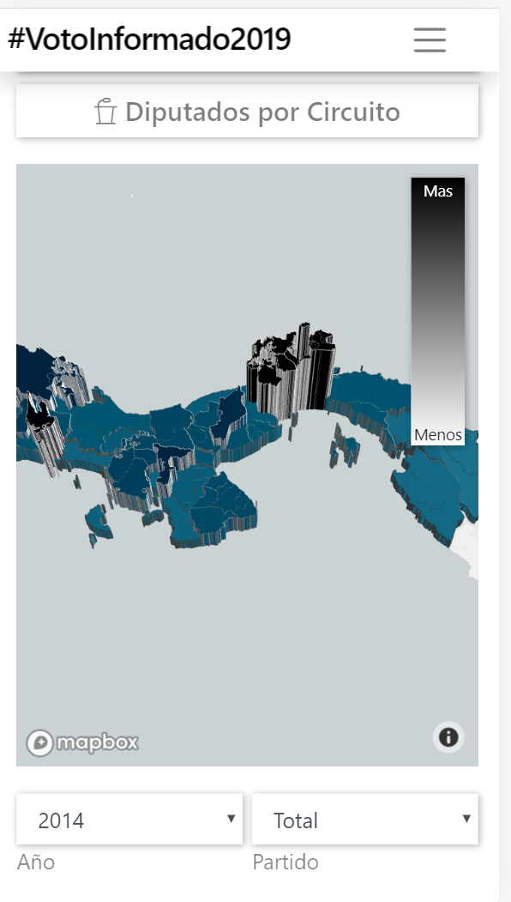

# Voto Informado Frontend

Welcome to the "Voto Informado" (Informed Vote) frontend repository. This web application was done for some Latin American elections in partnership with a local journalist organization [Praxis](https://www.facebook.com/holapraxis/). Using a large amount of government offical data from court cases, official financial documents,  historical news sources, etc. collected by the journalists, this site aimed to provide an interactive way for users to inform themselves. A site documenting this type of data did not exist for this country market.

Given the monthly backend costs (and the lack of some request-based plans) from Elasticsearch, AWS S3, Heroku, etc., the site was decommissioned shortly after the May 2019 elections. However, the frontend staging site is still hosted on [this surge site](http://vmain-staging.surge.sh/).

However, if you just want to check out how it looked with the data loaded, here are some snapshots:

Note frontend design documentation was written within each s folders whilst coding.
See `src/containers/App/App.md` for overall design so far.
